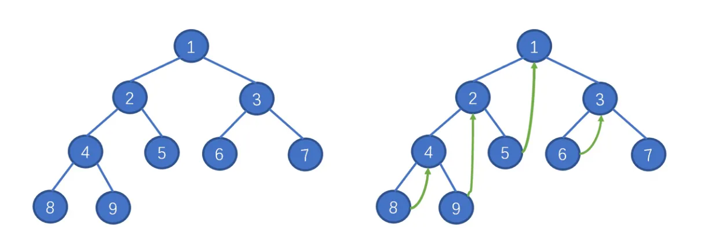

# 基本概念

* **满二叉树** ：深度为 $k$ ，结点数 $2^k-1$ 的二叉树
* **完全二叉树** ：只有最底层没有填满，并且最底层的结点都在左边
* **二叉搜索树** ：结点是有顺序的
* **平衡二叉搜索树** ：左右两子树的高度差不超过 $1$

# 遍历方法

## 深度遍历

实现方法：递归法比较简单就略过了，考虑迭代法的实现。

* 前序：中左右
* 后序：左右中（后序和前序遍历写法是一样的，因为可以理解成在前序过程中，将左右指针交换，最后把结果反转得到的：中右左 -> 左右中）
* 中序：左中右

迭代法的实现首先需要一个新建一个单独的**指针**用来访问树上的结点，并且使用一个临时的**栈**来辅助遍历。以前序遍历为例，实现如下：

```python
class Solution:
    def preorderTraversal(self, root: TreeNode) -> List[int]:
        res = []
        if not root:
            return res
  
        stack = []
        node = root
        while stack or node:
            while node:
                res.append(node.val)
                stack.append(node)
                node = node.left
            node = stack.pop()
            node = node.right
        return res
```

## 广度遍历

广度遍历的迭代法需要一个**队列**来辅助遍历：

```python
class Solution:
    def levelOrder(self, root: Optional[TreeNode]) -> List[List[int]]:
        if not root: return []
        res, queue = [], collections.deque()
        queue.append(root)
        while queue:
            tmp = []
            for _ in range(len(queue)):
                node = queue.popleft()
                tmp.append(node.val)
                if node.left: 
			        queue.append(node.left)
                if node.right: 
			        queue.append(node.right)
                    res.append(tmp)
        return res
```

## Morris遍历

Morris遍历的特点是其减少了遍历所需的空间复杂度，只使用$O(1)$的空间复杂度就能够对二叉树进行遍历。Morris的整体思路就是将从某个根结点开始，找到它**左子树的最右节点，与根结点进行连接**。



# 参考习题

| 题目                                                                                                                    | 提示                                                                                                                                                                   |
| ----------------------------------------------------------------------------------------------------------------------- | ---------------------------------------------------------------------------------------------------------------------------------------------------------------------- |
| [填充每个节点的下一个右侧节点指针 II](https://leetcode.cn/problems/populating-next-right-pointers-in-each-node-ii/)        | 考虑只使用常数空间应该如何求解                                                                                                                                         |
| [平衡二叉树](https://leetcode.cn/problems/balanced-binary-tree/)                                                           | 自底向上如何求解，怎么把高度差转化为答案结果                                                                                                                           |
| [二叉树的所有路径](https://leetcode.cn/problems/binary-tree-paths/)                                                        | 注意终止条件是到叶子节点，注意路径隐藏着回溯思想                                                                                                                       |
| [左叶子之和](https://leetcode.cn/problems/sum-of-left-leaves/)                                                             | 注意怎样用迭代法和递归法两种方法求解                                                                                                                                   |
| [路径总和](https://leetcode.cn/problems/path-sum/)                                                                         | 注意**终止条件**：叶子节点                                                                                                                                       |
| [路径总和 II](https://leetcode.cn/problems/path-sum-ii/)                                                                   | 与上题对比，如果只需要搜索树中**一条**满足条件的路径，则函数有返回值；<br />如果需要搜索树中**所有**满足条件的路径，则函数不需要返回值                     |
| [从中序与后序遍历序列构造二叉树](https://leetcode.cn/problems/construct-binary-tree-from-inorder-and-postorder-traversal/) | 理清思路顺序，首先获取**根节点**，接着在中序**划分左右；**<br />注意：**后序数组的切割**如何确定？<br />**优化时间复杂度**：通过哈希表保存位置 |
| [验证二叉搜索树](https://leetcode.cn/problems/validate-binary-search-tree/)                                                | 掌握二叉搜索树（BST）的性质：**中序遍历下二叉搜索树是有序序列**                                                                                                  |
| [二叉搜索树中的众数](https://leetcode.cn/problems/find-mode-in-binary-search-tree/)                                        | 代码与*验证二叉搜索树* 相似，利用BST性质转化成**有序序列**再统计结果                                                                                                |
| [二叉树的最近公共祖先](https://leetcode.cn/problems/lowest-common-ancestor-of-a-binary-tree/)                              | 理解本题 函数的返回值 如何处理                                                                                                                                         |
