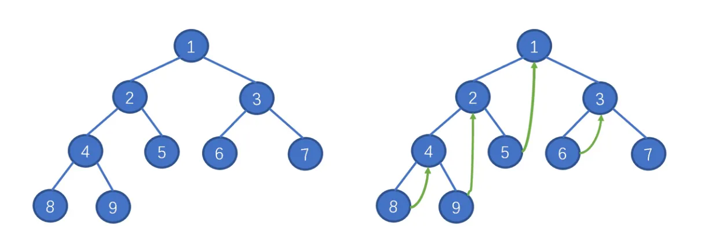

# Table of Contents
## 编程基础
- [Python](#python)
- [Java](#java)

## 数据结构与算法
- [基本知识](#基本知识)
- [常用数据结构](#常用数据结构)
  - [二叉树](#二叉树)
  - [图](#图)
- [常用算法](#常用算法)
  - [双指针](#双指针)
  - [二分查找](#二分查找)
  - [回溯](#回溯)
  - [动态规划](#动态规划)
  - [贪心](#贪心)
- [补充算法](#补充算法)
  - [前缀树（Trie）](#前缀树trie)

## 操作系统
- [文件系统](#文件系统)

## 数据库

## 设计模式

# 编程基础

## Python

| Class         | Description                    | Method                                                         |
| ------------- | ------------------------------ | -------------------------------------------------------------- |
| 数学运算      | 整除向下取整                   | a // 2                                                         |
|               | 整除向上取整                   | math.ceil(a / 2)                                               |
| str           | 统计字符串中的子字符串出现个数 | s.count()                                                      |
|               | list合并成字符串               | "".join(list)                                                  |
| array         | 创建固定大小的数组             | l = [0] * m<br />l = [[0] * m for _ in range(n)]               |
|               | 切片                           | lastTwo = l[-2:]                                               |
| list          | 新建列表                       | l = []                                                         |
|               | 插入新元素                     | l.append(1)<br />l.insert(1, 1)                                |
|               | 移除元素                       | l.remove(1)<br />l.pop(idx)                                    |
|               | 反转列表                       | l.reverse()                                                    |
|               | 对列表进行排序                 | l.sort()<br />l2 = sorted(l, key=lambda x: x[0], reverse=True) |
|               | 统计列表中的元素               | l.count(1)<br />max(l)<br />min(l)                             |
|               | 列表拷贝                       | l2 = l1[:]<br />l2 = copy.deepcopy(l1) # 深拷贝                |
|               | 查找                           | l.index(a)                                                     |
| set           | 新建集合                       | s = set('abracadabra')<br />s = set(l)                         |
|               | 插入新元素                     | s.add('x')                                                     |
|               | 移除元素                       | s.remove('x')                                                  |
| dict          | 新建字典                       | dict = {}                                                      |
|               | 添加新元素                     | dict.get(key, 0)                                               |
|               | 遍历字典                       | for key,value in dict.items():                                 |
| Counter       | 新建计数                       | c = Counter()                                                  |
| stack         | 新建栈                         | s = []                                                        |
|               | 添加元素                       | s.append(1)                                                    |
|               | 弹出元素                       | val = s.pop()                                                  |
| queue         | 新建队列                       | q = []                                                         |
|               | 添加元素                       | q.append(1)                                                    |
|               | 弹出元素                       | q.pop(0)                                                       |
| deque         | 新建双向队列                   | que = collections.deque()                                      |
|               | 添加元素                       | que.append(1)                                                  |
|               | 弹出元素                       | que.popleft()                                                  |
| priorityqueue | 新建优先队列                   | pq = []                                                        |
|               | 插入元素                       | heapq.heappush(pq, 1) # 小根                                   |
|               | 弹出元素                       | heapq.heappop(pq)                                              |
| 其他          | 生成前缀和                     | accumulate(data, initial=0)                                    |
|               | 遍历多个数组                   | for x, f in zip(nums, freq):                                   |

## Java

| Class          | Description        | Method                                                                                             |
| -------------- | ------------------ | -------------------------------------------------------------------------------------------------- |
| 控制台输入输出 | 创建对象           | Scanner input = new Scanner(System.in);                                                        |
|                | 读取整数           | int a = input.nextInt();                                                                           |
|                | 读取空格分割字符   | String s = input.next();                                                                           |
|                | 读取回车分割字符   | String s = input.nextLine();                                                                       |
|                | 循环读取           | while (input.hasNextLine(s))                                                                       |
|                | 格式化输出         | System.out.format();                                                                               |
| Arrays         | 排序               | Arrays.sort(a);                                                                                    |
|                | 填充               | Arrays.fill(a, 1);                                                                                 |
| List           | 新建列表           | List `<Integer>` a = new ArrayList<>();                                                          |
|                | 加入元素           | a.add(1);                                                                                          |
|                | 移除元素           | a.remove(4);                                                                                       |
|                | 对列表排序         | Collections.sort(a);                                                                               |
|                | 将列表反转         | Collections.reverse(a);                                                                            |
|                | 统计列表中元素     | Collections.max(a);<br />Collections.min(a);                                                       |
| Set            | 新建集合           | Set `<Character>` s = new HashSet `<Character>`();                                             |
|                | 加入元素           | s.add('a');                                                                                        |
|                | 移除元素           | s.remove('a');                                                                                     |
|                | 查询是否包含某元素 | s.contains('a');                                                                                   |
|                | 清除集合           | s.clear();                                                                                         |
| Map            | 新建哈希表         | Map<Integer,Integer> m = new HashMap<>();                                                          |
|                | 加入新元素         | m.put(a, b);                                                                                       |
|                | 获取元素           | m.get(k);                                                                                          |
|                | 查询元素           | m.containsKey(k)                                                                                   |
|                | 元素不存在时的处理 | m.putIfAbsent(k, 0);<br />m.getOrDefault(k, 0);                                                    |
|                | 遍历元素           | for (Map.Entry<String, Integer> en : m.entrySet());<br />en.getKey();<br />en.getValue();          |
| Stack          | 新建栈             | Stack `<Integer>` s = new LinkedList<>();                                                        |
|                | 加入元素           | s.push(1);                                                                                         |
|                | 弹出元素           | s.pop();                                                                                           |
| Queue          | 新建队列           | Queue `<Integer>` q = new LinkedList<>();                                                        |
|                | 加入元素           | q.offer(1);                                                                                        |
|                | 弹出元素           | q.poll();                                                                                          |
| Deque          | 新建双向队列       | Deque `<Integer>` dq = new LinkedList<>();                                                       |
|                | 加入元素           | dq.addFirst(1);<br />dq.addLast(1);                                                                |
|                | 弹出元素           | dq.pollFirst();<br />dq.pollLast();                                                                |
|                | 获得元素           | dq.peekFirst();<br />dq.peekLast();                                                                |
| PriorityQueue  | 新建优先队列       | PriorityQueue `<Integer>` pq = new PriorityQueue<>(((o1, o2) -> {return o2 - o1;})); // 默认小根 |
|                | 查询堆顶           | pq.peek();                                                                                         |
|                | 加入元素           | pq.offer(1);                                                                                       |
|                | 弹出元素           | pq.poll();                                                                                         |

# 数据结构与算法

## 基本知识

**数据范围与复杂度的关系：**

* $O(1)$: 数据范围不受限制
* $O(logn)$: 二分查找等复杂度为 $O(logn)$ 的算法，数据范围 $n$ 一般可以在 $10^9$ 这个量级内
* $O(n)$: 对于单调栈、单调队列、差分数组、BFS、DFS、贪心、哈希、前缀和、一维动态规划等复杂度为 $O(n)$ ， $n$ 一般可以在 $10^6$ 这个量级内
* $O(nlogn)$: 对于快速排序、（堆）优先队列、图、分治、字典树、线段树、并查集等复杂度为 $O(nlogn)$ ， $n$ 一般可以在 $10^5$ 这个量级内
* $O(n^2)$: 对于二维动态规划等复杂度为 $O(n^2)$ 的算法， $n$ 一般可以在 $10^3$ 这个量级内
* $O(n^3)$:  $n$ 一般可以在 $10^2$ 这个量级内
* $O(2^n)$: 对于状态压缩等复杂度为 $O(2^n)$ 的算法， $n$ 一般可以在 $16$ 内

总结：一般算法复杂度要控制在 $10^6$ 以内。

**解题技巧：**

* 子数组求和问题，可以用前缀和提高处理效率
* 涉及到搜索类问题，要明确左边界和右边界是左闭右开还是左闭右闭，并根据此处理边界条件
* 关于网格的问题，数据小可能是DFS、BFS，数据大可能是动态规划

## 常用数据结构

### 二叉树

#### 基本概念

* **满二叉树** ：深度为 $k$ ，结点数 $2^k-1$ 的二叉树
* **完全二叉树** ：只有最底层没有填满，并且最底层的结点都在左边
* **二叉搜索树** ：结点是有顺序的
* **平衡二叉搜索树** ：左右两子树的高度差不超过 $1$

#### 遍历方法

* 如果需要利用二叉搜索树性质，一般需要中序遍历
* 如果构造二叉树，一般需要前序遍历
* 如果在二叉树中做搜索，一般是自底向上，后序遍历

##### 深度遍历

实现方法：递归法比较简单就略过了，考虑迭代法的实现。

* 前序：中左右
* 后序：左右中（后序和前序遍历写法是一样的，因为可以理解成在前序过程中，将左右指针交换，最后把结果反转得到的：中右左 -> 左右中）
* 中序：左中右

迭代法的实现首先需要一个新建一个单独的**指针**用来访问树上的结点，并且使用一个临时的**栈**来辅助遍历。以前序遍历为例，实现如下：

```python
class Solution:
    def preorderTraversal(self, root: TreeNode) -> List[int]:
        res = []
        if not root:
            return res
  
        stack = []
        node = root
        while stack or node:
            while node:
                res.append(node.val)
                stack.append(node)
                node = node.left
            node = stack.pop()
            node = node.right
        return res
```

##### 广度遍历

广度遍历的迭代法需要一个**队列**来辅助遍历：

```python
class Solution:
    def levelOrder(self, root: Optional[TreeNode]) -> List[List[int]]:
        if not root: return []
        res, queue = [], collections.deque()
        queue.append(root)
        while queue:
            tmp = []
            for _ in range(len(queue)):
                node = queue.popleft()
                tmp.append(node.val)
                if node.left: 
			        queue.append(node.left)
                if node.right: 
			        queue.append(node.right)
                    res.append(tmp)
        return res
```

##### Morris遍历

Morris遍历的特点是其减少了遍历所需的空间复杂度，只使用$O(1)$的空间复杂度就能够对二叉树进行遍历。Morris的整体思路就是将从某个根结点开始，找到它**左子树的最右节点，与根结点进行连接**。



#### 参考习题

| 题目                                                                                                                    | 提示                                                                                                                                                                   |
| ----------------------------------------------------------------------------------------------------------------------- | ---------------------------------------------------------------------------------------------------------------------------------------------------------------------- |
| [填充每个节点的下一个右侧节点指针 II](https://leetcode.cn/problems/populating-next-right-pointers-in-each-node-ii/)        | 考虑只使用常数空间应该如何求解                                                                                                                                         |
| [平衡二叉树](https://leetcode.cn/problems/balanced-binary-tree/)                                                           | 自底向上如何求解，怎么把高度差转化为答案结果                                                                                                                           |
| [二叉树的所有路径](https://leetcode.cn/problems/binary-tree-paths/)                                                        | 注意终止条件是到叶子节点，注意路径隐藏着回溯思想                                                                                                                       |
| [左叶子之和](https://leetcode.cn/problems/sum-of-left-leaves/)                                                             | 注意怎样用迭代法和递归法两种方法求解                                                                                                                                   |
| [路径总和](https://leetcode.cn/problems/path-sum/)                                                                         | 注意**终止条件**：叶子节点                                                                                                                                       |
| [路径总和 II](https://leetcode.cn/problems/path-sum-ii/)                                                                   | 与上题对比，如果只需要搜索树中**一条**满足条件的路径，则函数有返回值；<br />如果需要搜索树中**所有**满足条件的路径，则函数不需要返回值                     |
| [从中序与后序遍历序列构造二叉树](https://leetcode.cn/problems/construct-binary-tree-from-inorder-and-postorder-traversal/) | 理清思路顺序，首先获取**根节点**，接着在中序**划分左右；**<br />注意：**后序数组的切割**如何确定？<br />**优化时间复杂度**：通过哈希表保存位置 |
| [验证二叉搜索树](https://leetcode.cn/problems/validate-binary-search-tree/)                                                | 掌握二叉搜索树（BST）的性质：**中序遍历下二叉搜索树是有序序列**                                                                                                  |
| [二叉搜索树中的众数](https://leetcode.cn/problems/find-mode-in-binary-search-tree/)                                        | 代码与*验证二叉搜索树* 相似，利用BST性质转化成**有序序列**再统计结果                                                                                           |
| [二叉树的最近公共祖先](https://leetcode.cn/problems/lowest-common-ancestor-of-a-binary-tree/)                              | 理解本题**函数的返回值**如何处理，<br />如果不需要搜索整棵树则找到目标后直接返回，否则使用变量暂存返回值                                                         |
| [二叉搜索树的最近公共祖先](https://leetcode.cn/problems/lowest-common-ancestor-of-a-binary-search-tree/)                   | 理解BST中最近公共祖先具有的性质                                                                                                                                        |
| [删除二叉搜索树中的节点](https://leetcode.cn/problems/delete-node-in-a-bst/)                                               | 分类讨论不同情况，特别是左右子树都不为空的情况                                                                                                                         |

### 图

#### 基本概念

图是由**节点**和**边**组成的。图的常用存储方式有两种：

* 邻接表
* 邻接矩阵

**度**：和每个节点相连的边的条数。有向图中的节点具有入度和出度。

#### 基本思路

图的题目经常涉及到搜索，在思考过程中需要考虑：

* 终止条件（点满足什么条件、边满足什么条件时终止搜索）

#### 遍历方法

##### 深度遍历

图的遍历方法和树类似，但一个重要的区别在于，图本身可能包含环。因此为了不重复地遍历每个节点，需要使用$visit$数组进行标记。

以下代码给出遍历图的最基本框架，注意，如果是遍历**无环图**不需要$visit$标记：

```python
def dfs(graph, s):
    if visited[s]:
        return
    visited[s] = True

    for neighbor in graph.neighbors(s):
        dfs(graph, neighbor)
```

##### 广度遍历

广度遍历和树一样，需要队列来保存需要搜索的点。由于广度遍历本身是往各个方向搜索的，因此必须$visit$标记点来防止无限循环。

求最短路径常用广搜，当广搜到达终点时，一定是最短路径。

```python
visited =  [[False] * n for _ in range(m)]

def bfs(grid, visited, x, y):
  queue = [] 
  queue.append((x, y)) 
  visited[x][y] = True 
  
  while queue: 
    curx, cury = queue.pop(0)
  
    for dx, dy in (0,1),(1,0),(0,-1),(-1,0):
      nextx, nexty = curx + dx, cury + dy
      if nextx < 0 or nextx >= len(grid) or nexty < 0 or nexty >= len(grid[0]): 
        continue
      if not visited[nextx][nexty]:
        queue.append((nextx, nexty)) 
        visited[nextx][nexty] = True
```

#### 并查集

**并查集的主要功能：**

* 将两个元素添加到同一个集合中
* 判断两个元素是否在同一个集合中

**并查集基本元素：**

为了控制代码量，可以考虑只保留并查集的基本元素，其他元素灵活增减。

* `parent`数组，用来表示每个点的根
* `union`、`find` 用于满足并查集基本操作

```python
class UF:
	def __init__(self, n):
		# 初始化时互不连通
		self.count = n
        	# 父节点指针初始指向自己
        	self.parent = [i for i in range(n)]

	def union(self, p, q):
		root_p = self.find(p)
        	root_q = self.find(q)
		if root_p == root_q:
            		return
		self.parent[root_p] = root_q
		self.count -= 1

	def find(self, x: int):
		if self.parent[x] != x:
            		self.parent[x] = self.find(self.parent[x]) # 路径压缩
        	return self.parent[x]

	def connected(self, p: int, q: int) -> bool:
        	root_p = self.find(p)
        	root_q = self.find(q)
        	return root_p == root_q

	def count(self) -> int:
        	return self.count
```

**理解并查集的路径压缩：**

为了压缩并查集中每个树的高度，降低时间复杂度，需要修改 `find`函数。保证任意树的高度保持在常数。路径压缩后的并查集时间复杂度在$O(logn)$与$O(1)$之间，且随着查询或者合并操作的增加，时间复杂度会越来越趋于$O(1)$。

#### 最短路径

#### 参考习题

| 题目                                                           | 提示                                                                                       |
| -------------------------------------------------------------- | ------------------------------------------------------------------------------------------ |
| [岛屿数量](https://leetcode.cn/problems/number-of-islands/)       | 图论基础题，重要的是从本题掌握DFS、BFS、并查集的技巧                                       |
| [飞地的数量](https://leetcode.cn/problems/number-of-enclaves/)    | 将与边界相连的地都标记成海洋，最后再统计飞地个数                                           |
| [冗余连接](https://leetcode.cn/problems/redundant-connection/)    | 并查集应用，如果在遍历边的过程中，发现了已经处于同一集合的点，则说明存在环                 |
| [最大人工岛](https://leetcode.cn/problems/making-a-large-island/) | 如果使用暴力枚举方法的话复杂度为$O(n^4)$，因此需要做优化，首先统计岛屿面积并保存到数组里 |
| [单词接龙](https://leetcode.cn/problems/word-ladder/)             | BFS统计最短路径                                                                            |

## 常用算法

### 双指针

#### 基本概念

题目中出现的一般是双指针，主要场景有：链表、数组、字符串。双指针基本算法的复杂度是$O(n)$。

需要注意的事项：

* 指针移动方向（同向移动/反向移动）
* 指针的边界（左闭右开/左闭右闭）

#### 参考习题

| 题目                                                            | 提示                                                                   |
| --------------------------------------------------------------- | ---------------------------------------------------------------------- |
| [验证回文串 II](https://leetcode.cn/problems/valid-palindrome-ii/) | 题目能够删除一个字符，注意删除可以有两种方法                           |
| [移除元素](https://leetcode.cn/problems/remove-element/)           | 双指针，一个指向目前处理好的部分，一个指向待处理部分，注意指针移动方向 |

### 二分查找

#### 基本概念

二分查找一般用于查找有序数组中的元素。除此之外，还能够处理单调值问题比如最大值最小。

注意事项：

* 区间的选择（左闭右开/左闭右闭）和停止条件、转移方程要对应起来
* 所有二分查找都要注意**缩小时的边界问题**，是否会死循环（可以模拟**数组里只有两个数**的情况，看是否会死循环）

#### 模版

##### = target

注意，因为选择的是左闭右开的区间里，也就是 [left, right)，那么题中：

* while (left < right)，这里使用 < ,因为left == right在区间 [left, right) 是没有意义的
* right 更新为 mid，因为当前 nums[mid] 不等于 target ，去左区间继续寻找，而寻找区间是左闭右开区间，所以right更新为middle

```java
public int search(int[] nums, int target) {
    int left = 0, right = nums.length;
    while (left < right) {
        int mid = (left + right) / 2;
        if (nums[mid] == target) {
            return mid;
        } else if (nums[mid] > target) {
            right = mid;
        } else {
            left = mid + 1;
        }
    }
    return -1;
}
```

#### 参考习题

| 题目                                                                                     | 提示                                                                         |
| ---------------------------------------------------------------------------------------- | ---------------------------------------------------------------------------- |
| [分割数组的最大值](https://leetcode.cn/problems/split-array-largest-sum/)                   | 二分查找的最大值最小问题，已知要将数组分成m部分，二分m部分的最大值           |
| [标记所有下标的最早秒数 I](https://leetcode.cn/problems/earliest-second-to-mark-indices-i/) | 时间越大，越能够标记所有下标，因此具有**单调性**。使用二分能够解决问题 |

### 回溯

#### 基本概念

回溯法是一种搜索算法，使用递归实现。回溯法的效率并不高，因此只能在数据量小的情况下使用。

回溯法，一般可以解决如下几种问题：

* 组合问题：N个数里面按一定规则找出k个数的集合
* 切割问题：一个字符串按一定规则有几种切割方式
* 子集问题：一个N个数的集合里有多少符合条件的子集
* 排列问题：N个数按一定规则全排列，有几种排列方式
* 棋盘问题：N皇后，解数独等等

回溯算法注意事项：

* 终止条件：注意算法一定要写好终止条件，否则无法终结

#### 排列与组合

什么时候使用 `used` 数组，什么时候使用 `beginIdx` 变量：

* 排列问题，讲究顺序（即 [2, 2, 3] 与 [2, 3, 2] 视为不同列表时），需要记录哪些数字已经使用过，此时用 `used` 数组；
* 组合问题，不讲究顺序（即 [2, 2, 3] 与 [2, 3, 2] 视为相同列表时），需要按照某种顺序搜索，此时使用 `beginIdx` 变量（因为没有顺序，因此最开始就要定下一个顺序）。

排列：

```java
class Solution {
    LinkedList<Integer> tmp = new LinkedList<>();
    List<List<Integer>> res = new ArrayList<>();

    public List<List<Integer>> permute(int[] nums) {
        boolean[] use = new boolean[nums.length];
        backTracking(nums, use);
        return res;
    }

    private void backTracking(int nums[], boolean[] use) {
        if (tmp.size() == nums.length) {
            res.add(new ArrayList<Integer>(tmp));
            return;
        }

        for (int i = 0; i < nums.length; i++) {
            if (use[i]) continue;
            use[i] = true;
            tmp.add(nums[i]);
            backTracking(nums, use);
            tmp.removeLast();
            use[i] = false;
        }
    }
}
```

组合：

```java
class Solution {
    List<List<Integer>> res = new ArrayList<>(); 
    LinkedList<Integer> list = new LinkedList<>();

    public List<List<Integer>> subsets(int[] nums) {
        backTracking(nums, 0);
        return res;
    }

    public void backTracking(int[] nums, int idx) {
        res.add(new ArrayList<Integer>(list));
        int s = nums.length;

        for (int i = idx;i < s;i++) {
            list.add(nums[i]);
            backTracking(nums, i+1);
            list.removeLast();
        }
    }
}
```

#### 参考习题

| 题目 | 提示 |
| ---- | ---- |
|      |      |
|      |      |

### 动态规划

#### 基本概念

动态规划针对的情景是重叠子问题的情景，由前至状态转向下一个状态。与贪心的区别在于，

思考方式：

* 确定DP数组以及下标的含义
* 确定递推公式以及初始化
* 确定遍历顺序

#### 背包问题

背包问题是动态规划中一类重要的问题。

$dp[j]$表示：容量为j的背包，所背的物品价值可以**最大**为$dp[j]$，那么$dp[0]$就应该是$0$（背包不一定是装满的，因为只需要价值最大）。

##### 01背包

$n$件不同重量和价值的物品，背包的重量为$w$。每件物品只能用**一次**。

注意：代码版本是用滚动数组进行压缩后的版本。因此要注意遍历顺序。**倒序遍历是为了保证物品只被放入一次！** 如果一旦正序遍历了，那么物品就会被重复加入多次。

```java
for(int i = 0; i < weight.size(); i++) { // 遍历物品
    for(int j = bagWeight; j >= weight[i]; j--) { // 遍历背包容量
        dp[j] = max(dp[j], dp[j - weight[i]] + value[i]);
    }
}
```

##### 完全背包

和01背包不同的地方在于，每种物品有**无限件**。

```java
for(int i = 0; i < weight.size(); i++) { // 遍历物品
    for(int j = weight[i]; j <= bagWeight ; j++) { // 遍历背包容量
        dp[j] = max(dp[j], dp[j - weight[i]] + value[i]);

    }
}
```

如果求组合数就是外层for循环遍历物品，内层for遍历背包。
如果求排列数就是外层for遍历背包，内层for循环遍历物品。

#### 划分DP

需要把数组划分成n个区间。转移方程类似：

```python
dp[i][j] = max(dp[k][j - 1] * xxx, dp[i][j])
```

#### 参考习题

| 题目                                                                                                | 提示                                                                                   |
| --------------------------------------------------------------------------------------------------- | -------------------------------------------------------------------------------------- |
| [最小路径和](https://leetcode.cn/problems/minimum-path-sum/)                                           | DP基础题，注意转移方向。如果是单边移动一般是DP，如果各个方向可能是搜索或者图论         |
| [整数拆分](https://leetcode.cn/problems/integer-break/)                                                | 转移方程的书写注意有两种情况：拆分or不拆分                                             |
| [回文子串](https://leetcode.cn/problems/palindromic-substrings/)                                       | 对回文串的判断也存在重叠子问题。重点是考虑DP数组的遍历顺序。根据转移方程来规划遍历顺序 |
| [分割等和子集](https://leetcode.cn/problems/partition-equal-subset-sum/)                               | 01背包第一题，注意本题的value选择有一点绕                                              |
| [零钱兑换](https://leetcode.cn/problems/coin-change/)                                                  | 完全背包第一题，按照模版套公式，注意初始化                                             |
| [零钱兑换 II](https://leetcode.cn/problems/coin-change-ii/)                                            | 完全背包第二题，首先确定求的是组合数，因此DP数组的值代表组合数。还要注意初始化问题     |
| [K 个不相交子数组的最大能量值](https://leetcode.cn/problems/maximum-strength-of-k-disjoint-subarrays/) | 划分DP例题，求解不同数组划分的最大值                                                   |

### 贪心

#### 基本概念

贪心的思想就是通过局部最优达到全局最优。贪心的题经常需要排序。

#### 参考习题

| 题目 | 提示 |
| ---- | ---- |
|      |      |
|      |      |

## 补充算法

### 前缀树（Trie）

假设所有字符串长度和为$n$，构建字典树时间复杂度$O(n)$，查找字符串长度为$k$，查找时间复杂度$O(k)$。

```python
class Trie:
  def __init__(self):
    self.nodes = {}   
    self.end = False  
    self.count = 0  

  def insert(self, word):
      curr = self
      for c in word:
          if not curr.nodes.get(c, None):
              new_node = Trie()
              curr.nodes[c] = new_node
          curr = curr.nodes[c]
      curr.is_end = True
      self.count += 1
      return

  def search(self, word):
      curr = self
      for c in word:
          if c in curr.sons: 
            curr = curr.nodes[c]
          else:
            break
      return curr.end
```

# 操作系统

## 文件系统

### 软链接和硬链接的区别？

|                    | 软链接                                                                  | 硬链接                                                                                     |
| ------------------ | ----------------------------------------------------------------------- | ------------------------------------------------------------------------------------------ |
| 是否支持跨文件系统 | 是                                                                      | 否                                                                                         |
| 索引节点           | 软链接原文件和链接文件拥有不同的inode号，<br />表明它们是两个不同的文件 | 硬链接原文件和链接文件共用同一个inode号，<br />表明它们是同一个文件                        |
| 主要作用           | 通常用于创建快捷方式，以方便用户访问文件或目录                          | 硬链接能够允许一个文件拥有多个有效路径名，<br />可用于创建备份，多个文件可以指向同一份数据 |

# 数据库

## 数据库分片

* **定义**：把数据切分成若干部分，然后将这些部分分散存储在多个数据库服务器上。分片能让数据库处理更多事务，存储更多数据。
* **分片与分区的区别**：分区发生在单个数据库服务器内部，分片的数据位于多个数据库服务器上。
* **常用分片方式：**
  * 基于键的分片：如对ID列应用哈希函数，决定分片。
    * 有利于实现均匀分布数据。可随着数据增长，需要重新整理已有数据，维护成本较高。
  * 基于范围的分片：根据某一列的范围决定分片。
    * 适合时序数据这样具有清晰、均匀划分的数据类型。但如果某些范围比其他范围拥有更多数据（即热点），则可能导致数据分布不均。
  * 基于目录的分片：维护一个索引表，根据查找索引列在表中记录的分片值分片
    * 引入的查找目录也带来了单点故障的风险。同时，维护和保持目录的一致性也是重要的考虑因素。
  * 垂直分片：将列分布在不同的分片中。这种模式用于将宽表分割成多个表，其中一个表比另一个表更窄，而这个更窄的表将包含最常查询的数据。
    * 适用于包含大量未使用列的表，通过隔离频繁访问的数据来提高性能。

# 设计模式


# 参考资料

* [代码随想录](https://programmercarl.com/)
* [图解计算机基础](https://xiaolincoding.com/)
